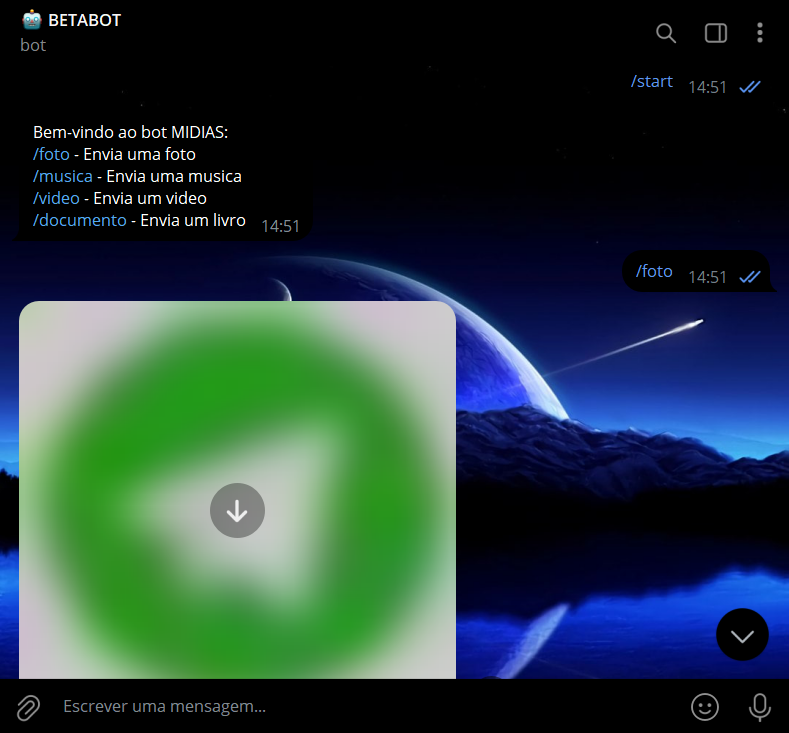
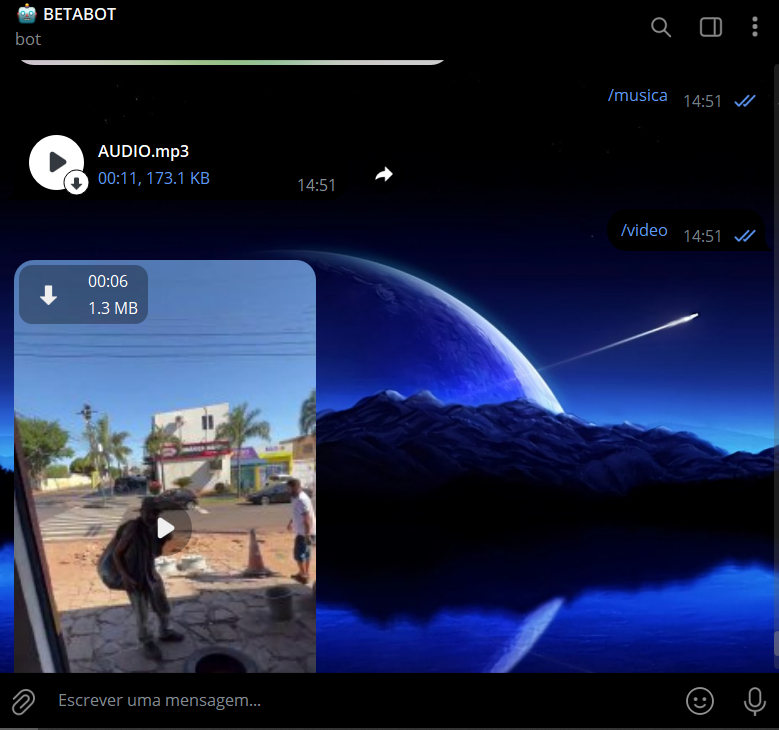
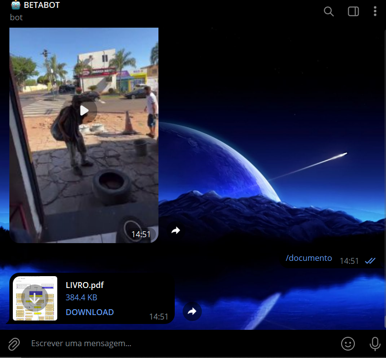

# MIDIAS COM TELEGRAF
🤤ESSE É UM BOT DO TELEGRAM DE MULTIMIDIAS COM TELEGRAF (NODEJS/JS)!

 <br>
 <br>
 <br>

## DESCRIÇÃO:
Este bot do Telegram é um exemplo simples que envia diferentes tipos de mídia aos usuários mediante comandos específicos. O bot pode enviar fotos, músicas, vídeos e documentos armazenados localmente. 

## FUNCIONALIDADES:
1. **Comando /start**:
   - Dá as boas-vindas ao usuário e exibe as opções disponíveis.
   - Mensagem de boas-vindas: "Bem-vindo ao bot MIDIAS:\n/foto - Envia uma foto\n/musica - Envia uma música\n/video - Envia um vídeo\n/documento - Envia um livro".

2. **Comando /foto**:
   - Envia uma foto específica ao usuário.
   - A foto é enviada a partir do caminho local `./MIDIAS/FOTO.png`.
   - Se houver um erro ao enviar a foto, uma mensagem de erro será exibida.

3. **Comando /musica**:
   - Envia um arquivo de áudio (música) ao usuário.
   - A música é enviada a partir do caminho local `./MIDIAS/AUDIO.mp3`.
   - Se houver um erro ao enviar a música, uma mensagem de erro será exibida.

4. **Comando /video**:
   - Envia um vídeo ao usuário.
   - O vídeo é enviado a partir do caminho local `./MIDIAS/VIDEO.mp4`.
   - Se houver um erro ao enviar o vídeo, uma mensagem de erro será exibida.

5. **Comando /documento**:
   - Envia um documento ao usuário.
   - O documento é enviado a partir do caminho local `./MIDIAS/LIVRO.pdf`.
   - Se houver um erro ao enviar o documento, uma mensagem de erro será exibida.

## EXECUTANDO O PROJETO:
1. **Editar o código:**
   - Certifique-se de substituir "seu_token_aqui" pelas informações corretas das suas credenciais em `CODIGO/.env`.

2. **Instalando as Depêndencias:**
   - Para instalar as dependências listadas no arquivo "package.json", você pode usar o comando `npm install` no terminal. Certifique-se de estar no diretório do seu projeto onde o arquivo "package.json" está localizado (`CODIGO`). O npm irá ler o arquivo "package.json" e instalar todas as dependências listadas nele. 

   ```bash
   npm install
   ```

3. **Inicie o Bot:**
   - Execute o bot do Telegram iniciando-o com o seguinte comando:
    ```bash
    npm start
    ```

4. **Interagindo com o Bot:**
   1. **Iniciar o Bot**:
      - Envie o comando `/start` para iniciar o bot e visualizar as opções disponíveis.

   2. **Receber uma Foto**:
      - Envie o comando `/foto` para receber uma foto armazenada no caminho `./MIDIAS/FOTO.png`.

   3. **Receber uma Música**:
      - Envie o comando `/musica` para receber uma música armazenada no caminho `./MIDIAS/AUDIO.mp3`.

   4. **Receber um Vídeo**:
      - Envie o comando `/video` para receber um vídeo armazenado no caminho `./MIDIAS/VIDEO.mp4`.

   5. **Receber um Documento**:
      - Envie o comando `/documento` para receber um documento armazenado no caminho `./MIDIAS/LIVRO.pdf`.

## NÃO SABE?
- Entendemos que para manipular arquivos em muitas linguagens e tecnologias relacionadas, é necessário possuir conhecimento nessas áreas. Para auxiliar nesse aprendizado, oferecemos cursos gratuitos disponíveis:
* [CURSO DE TELEGRAF](https://github.com/VILHALVA/CURSO-DE-TELEGRAF)
* [CURSO DE JAVASCRIPT](https://github.com/VILHALVA/CURSO-DE-JAVASCRIPT)
* [CURSO DE NODEJS](https://github.com/VILHALVA/CURSO-DE-NODEJS)
* [CONFIRA MAIS CURSOS](https://github.com/VILHALVA?tab=repositories&q=+topic:CURSO)

## CREDITOS:
- [PROJETO CRIADO PELO VILHALVA](https://github.com/VILHALVA)

